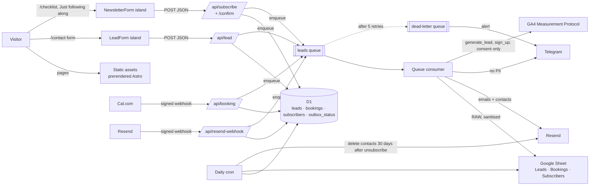

# Architecture

One Cloudflare Worker serves everything: prerendered pages as static assets, `/api/*` on demand, a queue
consumer and a daily cron (ADR 002). Pages are Astro; only interactive parts are React islands (ADR 001).

## Code map

| Path                                                 | Role                                                                          |
| ---------------------------------------------------- | ----------------------------------------------------------------------------- |
| `src/worker.ts`                                      | Worker entry: Astro `fetch`, the `queue` consumer and the `scheduled` cron    |
| `src/pages/api/lead.ts`                              | Thin route; logic in `src/lib/server/leadHandler.ts`                          |
| `src/pages/api/booking.ts`                           | Cal.com webhook (signature checked first)                                     |
| `src/pages/api/health.ts`                            | Public liveness + D1 check (credential-free on purpose)                       |
| `src/pages/api/subscribe.ts`, `subscribe/confirm.ts` | Newsletter sign-up and confirm; logic in `src/lib/server/subscribeHandler.ts` |
| `src/pages/api/resend-webhook.ts`                    | Resend contact webhook (Svix signature checked first)                         |
| `src/lib/lead.ts`                                    | The lead zod schema, shared by the form and the API                           |
| `src/lib/server/leadStore.ts`                        | Idempotent insert of a lead and its pending outbox rows, in one D1 batch      |
| `src/lib/server/formGuard.ts`                        | Checks shared by the form endpoints: origin, rate limit, size, bot checks     |
| `src/lib/server/subscriberStore.ts`                  | Subscribers: sign-up, confirm tokens (hashed), unsubscribe, purges            |
| `src/lib/server/subscriberDelivery.ts`               | The subscriber's delivery steps                                               |
| `src/lib/server/resendContacts.ts`                   | Resend contacts and segment; webhook signature check                          |
| `src/lib/server/outbox.ts`                           | Runs delivery steps and records each one, so retries only repeat failures     |
| `src/lib/server/delivery.ts`                         | Wires steps to integrations; alert transports                                 |
| `src/lib/server/{sheets,googleAuth}.ts`              | Sheets append/purge; service-account JWT signed with WebCrypto                |
| `src/lib/server/notifications.ts`                    | Resend emails and Telegram messages                                           |
| `src/lib/server/bookings.ts`                         | Cal.com webhook verification, parsing and storage                             |
| `src/lib/server/ga.ts`                               | Server-side `generate_lead` and `sign_up`                                     |
| `src/lib/server/cron.ts`                             | Daily re-sync, retention purge, deep health checks, alerts                    |
| `migrations/`                                        | D1 schema                                                                     |

## The lead flow

1. **The form** (`LeadForm.tsx`) validates with the shared schema and posts JSON with a Turnstile token, a
   honeypot field and the time the form was shown. It needs JavaScript (Turnstile does); `<noscript>`
   offers the email address instead.
2. **`/api/lead`** checks, in order: same origin → per-IP rate limit (5/min, 429) → size and JSON → honeypot
   and a 3-second minimum fill time → zod → Turnstile. Turnstile runs last so a typo doesn't spend the token.
3. **D1 first (ADR 003).** One batch inserts the lead (unique idempotency key: email + path + 10-minute
   window) and five pending outbox rows: `sheets`, `notify`, `autoreply`, `telegram`, `ga`. Only then does
   the visitor see success. A duplicate submit returns success without a new row.
4. **Queue.** The lead ID is enqueued. If enqueueing fails the lead is still safe; the cron picks it up.
5. **Consumer.** Runs each pending step and records `done`, `skipped` with the reason, or `failed` with
   the error. Failures retry at 1, 2, 4, 8… minutes (capped at 1 h); after 5 retries the message goes to the dead-letter queue,
   which alerts. Resend calls carry an `Idempotency-Key`, so a retried email sends once.
6. **Daily cron** (03:30 UTC): re-runs steps pending or failed for over an hour, deletes leads and bookings
   older than 18 months from D1 **and** the Sheet, checks Google and Telegram credentials, and alerts on
   anything wrong.

Bookings follow the same path: Cal.com → `/api/booking` (HMAC-SHA256 signature) → D1 → queue → `sheets` and
`telegram` steps, one delivery per event (created, rescheduled, cancelled).

## The subscribe flow (double opt-in)

1. **The form** (`NewsletterForm.tsx`, on /checklist and as the "Just following along" path of /contact)
   posts email, consent and `source` with the same anti-bot fields as the lead form.
2. **`/api/subscribe`** runs the shared checks (`formGuard.ts`: same origin → rate limit on its own
   `subscribe:<ip>` key → size and JSON → honeypot and a 1.5-second minimum fill time), then zod, then
   Turnstile (its own `subscribe` action). The answer is `{ ok: true }` whether the address is new,
   pending or already confirmed, so the endpoint can't reveal who is on the list.
3. **D1 first.** `subscribers` holds one row per address (`pending → confirmed → unsubscribed`). A new or
   returning sign-up gets a confirm token: 32 random bytes, stored only as a SHA-256 hash, valid 7 days.
   The raw token travels only in the queue message. A repeat sign-up within 24 hours of the last
   confirmation email changes nothing, so the form can't be used to flood an inbox or cancel a link.
4. **`confirm_email`** emails `/subscribe/confirm#t=<token>`. The token is in the fragment, which never
   reaches a server or analytics; the page moves it out of the address bar before anything loads, and
   only its **Confirm** button (a POST to `/api/subscribe/confirm`) confirms, so mail scanners that open
   links confirm nothing. Expired, used and unknown tokens get the same answer.
5. **On confirm**, four steps: `sheets` (a row in the Subscribers tab), `audience` (a Resend contact in the
   environment's segment, `RESEND_SEGMENT_ID`), `checklist_email` (the PDF link) and `ga` (`sign_up`,
   consent only).
6. **Unsubscribing** happens in Resend (every newsletter email's link, or by hand in the dashboard). Resend
   calls `/api/resend-webhook` (`contact.updated` with `unsubscribed: true`, or `contact.deleted`); the
   Worker marks the row `unsubscribed` and queues `sheet_status`, which sets the Sheet row to Unsubscribed.
   Unknown addresses (another environment's contacts share the Resend account) are ignored with a 200.
7. **Daily cron:** re-sends a confirmation that never went out (with a fresh token), deletes `pending`
   rows 30 days after their last sign-up, and deletes `unsubscribed` addresses 30 days after they
   unsubscribed: Sheet rows and the Resend contact first, then D1, so a failure is retried the next day.

Every step is an `outbox_status` row with `ref_kind = 'subscriber'`, like leads (ADR 003).

## Privacy rules built into the code

- Telegram and GA never receive names, emails or messages; unit tests assert it.
- Sheet cells that look like formulas are prefixed with `'` (CSV/Excel injection).
- Outside production, auto-replies and subscriber emails go to the inbox instead of the visitor (subject
  prefixed `[env → address]`), GA uses the validation endpoint, and Telegram messages are prefixed with
  the environment.
- Confirm tokens are stored hashed and never logged; the queue consumer logs only message kind and id.
- Alerts carry IDs and step names only.

## Environments (ADR 006)

| Environment | Worker                     | Bindings                                                                      | Who deploys                                 |
| ----------- | -------------------------- | ----------------------------------------------------------------------------- | ------------------------------------------- |
| local       | `wrangler dev`             | local D1 and queue; secrets from `.dev.vars`                                  | you                                         |
| staging     | `abhishekgoyal-me-staging` | own D1, queue + DLQ, test Sheet, Turnstile test keys                          | each PR's CI run (version deployed to 100%) |
| production  | `abhishekgoyal-me`         | D1 `abhishekgoyal-me`, `leads` + `leads-dlq`, prod Sheet, real Turnstile keys | CI on merge to `main`                       |

The Cloudflare adapter picks the environment at **build** time (`CLOUDFLARE_ENV=staging pnpm build`). Queue
consumers and crons only run on a Worker's _deployed_ version, which is why PR previews deploy to staging.

## Production (live since 23 September 2026)

| Piece           | Value                                                                                                               |
| --------------- | ------------------------------------------------------------------------------------------------------------------- |
| Site            | `https://abhishekgoyal.me` (Worker custom domain on the apex; `www` 301s to it)                                     |
| Worker          | `abhishekgoyal-me`, also on `abhishekgoyal-me.abhigoel23.workers.dev` (noindex)                                     |
| Database        | D1 `abhishekgoyal-me`, migrations applied by CI before each deploy                                                  |
| Queues          | `leads`, dead letters to `leads-dlq`                                                                                |
| Cron            | 03:30 UTC daily: re-sync, 18-month and 30-day purges, deep health check, alerts                                     |
| Sheet           | "abhishekgoyal.me leads", `Leads`, `Bookings` and `Subscribers` tabs                                                |
| Newsletter      | Resend contacts in the "abhishekgoyal.me newsletter" segment (`RESEND_SEGMENT_ID`), live since 24 September 2026    |
| Resend webhook  | `https://abhishekgoyal.me/api/resend-webhook`: `contact.updated`, `contact.deleted`; secret `RESEND_WEBHOOK_SECRET` |
| Service account | `leads-writer-prod@abhishekgoyal-me.iam.gserviceaccount.com` (separate from staging)                                |
| Analytics       | GA4 `G-PHG39RRGSZ` after consent, Cloudflare Web Analytics always                                                   |
| Alerts          | email to `contact@abhishekgoyal.me` and Telegram, from the cron and the DLQ consumer                                |

`/api/lead` and `/api/subscribe` return 503 whenever `DB`, `LEAD_QUEUE`, `RATE_LIMITER` or
`TURNSTILE_SECRET` is missing, so bindings can be added before the secrets that make the forms live. Until
`RESEND_CONTACTS_KEY` and `RESEND_SEGMENT_ID` are set, the `audience` step fails and retries (the sign-up
itself, its emails and the Sheet row still work), and the Resend health check stays off.
