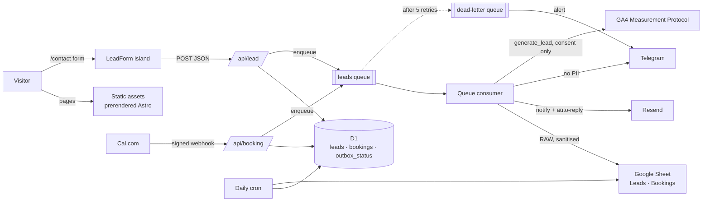

# Architecture

One Cloudflare Worker serves everything: prerendered pages as static assets, `/api/*` on demand, a queue
consumer and a daily cron (ADR 002). Pages are Astro; only interactive parts are React islands (ADR 001).

## Code map

| Path                                    | Role                                                                       |
| --------------------------------------- | -------------------------------------------------------------------------- |
| `src/worker.ts`                         | Worker entry: Astro `fetch`, the `queue` consumer and the `scheduled` cron |
| `src/pages/api/lead.ts`                 | Thin route; logic in `src/lib/server/leadHandler.ts`                       |
| `src/pages/api/booking.ts`              | Cal.com webhook (signature checked first)                                  |
| `src/pages/api/health.ts`               | Public liveness + D1 check (credential-free on purpose)                    |
| `src/lib/lead.ts`                       | The lead zod schema, shared by the form and the API                        |
| `src/lib/server/leadStore.ts`           | Idempotent insert of a lead and its pending outbox rows, in one D1 batch   |
| `src/lib/server/outbox.ts`              | Runs delivery steps and records each one, so retries only repeat failures  |
| `src/lib/server/delivery.ts`            | Wires steps to integrations; alert transports                              |
| `src/lib/server/{sheets,googleAuth}.ts` | Sheets append/purge; service-account JWT signed with WebCrypto             |
| `src/lib/server/notifications.ts`       | Resend emails and Telegram messages                                        |
| `src/lib/server/bookings.ts`            | Cal.com webhook verification, parsing and storage                          |
| `src/lib/server/ga.ts`                  | Server-side `generate_lead`                                                |
| `src/lib/server/cron.ts`                | Daily re-sync, retention purge, deep health checks, alerts                 |
| `migrations/`                           | D1 schema                                                                  |

## The lead flow

1. **The form** (`LeadForm.tsx`) validates with the shared schema and posts JSON with a Turnstile token, a
   honeypot field and the time the form was shown. It needs JavaScript (Turnstile does); `<noscript>`
   offers the email address instead.
2. **`/api/lead`** checks, in order: same origin → per-IP rate limit (5/min, 429) → size and JSON → honeypot
   and a 3-second minimum fill time → zod → Turnstile. Turnstile runs last so a typo doesn't spend the token.
3. **D1 first (ADR 003).** One batch inserts the lead (unique idempotency key: email + path + 10-minute
   window) and five pending outbox rows: `sheets`, `notify`, `autoreply`, `telegram`, `ga`. Only then does
   the visitor see success. A duplicate submit returns success without a new row.
4. **Queue.** The lead ID is enqueued. If enqueueing fails the lead is still safe; the cron picks it up.
5. **Consumer.** Runs each pending step and records `done`, `skipped` with the reason, or `failed` with
   the error. Failures retry at 1, 2, 4, 8… minutes (capped at 1 h); after 5 retries the message goes to the dead-letter queue,
   which alerts. Resend calls carry an `Idempotency-Key`, so a retried email sends once.
6. **Daily cron** (03:30 UTC): re-runs steps pending or failed for over an hour, deletes leads and bookings
   older than 18 months from D1 **and** the Sheet, checks Google and Telegram credentials, and alerts on
   anything wrong.

Bookings follow the same path: Cal.com → `/api/booking` (HMAC-SHA256 signature) → D1 → queue → `sheets` and
`telegram` steps, one delivery per event (created, rescheduled, cancelled).

## Privacy rules built into the code

- Telegram and GA never receive names, emails or messages; unit tests assert it.
- Sheet cells that look like formulas are prefixed with `'` (CSV/Excel injection).
- Outside production, auto-replies go to the inbox instead of the visitor, GA uses the validation endpoint,
  and Telegram messages are prefixed with the environment.
- Alerts carry IDs and step names only.

## Environments (ADR 006)

| Environment | Worker                     | Bindings                                                                      | Who deploys                                 |
| ----------- | -------------------------- | ----------------------------------------------------------------------------- | ------------------------------------------- |
| local       | `wrangler dev`             | local D1 and queue; secrets from `.dev.vars`                                  | you                                         |
| staging     | `abhishekgoyal-me-staging` | own D1, queue + DLQ, test Sheet, Turnstile test keys                          | each PR's CI run (version deployed to 100%) |
| production  | `abhishekgoyal-me`         | D1 `abhishekgoyal-me`, `leads` + `leads-dlq`, prod Sheet, real Turnstile keys | CI on merge to `main`                       |

The Cloudflare adapter picks the environment at **build** time (`CLOUDFLARE_ENV=staging pnpm build`). Queue
consumers and crons only run on a Worker's _deployed_ version, which is why PR previews deploy to staging.

## Production (live since 23 September 2026)

| Piece           | Value                                                                                |
| --------------- | ------------------------------------------------------------------------------------ |
| Site            | `https://abhishekgoyal.me` (Worker custom domain on the apex; `www` 301s to it)      |
| Worker          | `abhishekgoyal-me`, also on `abhishekgoyal-me.abhigoel23.workers.dev` (noindex)      |
| Database        | D1 `abhishekgoyal-me`, migrations applied by CI before each deploy                   |
| Queues          | `leads`, dead letters to `leads-dlq`                                                 |
| Cron            | 03:30 UTC daily: re-sync, 18-month purge, deep health check, alerts                  |
| Sheet           | "abhishekgoyal.me leads", `Leads` and `Bookings` tabs                                |
| Service account | `leads-writer-prod@abhishekgoyal-me.iam.gserviceaccount.com` (separate from staging) |
| Analytics       | GA4 `G-PHG39RRGSZ` after consent, Cloudflare Web Analytics always                    |
| Alerts          | email to `contact@abhishekgoyal.me` and Telegram, from the cron and the DLQ consumer |

`/api/lead` returns 503 whenever `DB`, `LEAD_QUEUE`, `RATE_LIMITER` or `TURNSTILE_SECRET` is missing, so
bindings can be added before the secrets that make the form live.
